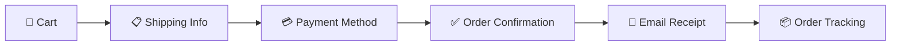

# 🍦 Sweet Frozen E-commerce

> ร้านไอศกรีมออนไลน์ชั้นนำ ส่งไอศกรีมคุณภาพสูง สดใหม่ อร่อย ถึงบ้านคุณทุกวัน

[](https://github.com/OvenKung/sweet-frozen-ecommerce_1650700865_1650705294_1670704632_CS319_427D/actions)
[](https://github.com/OvenKung/sweet-frozen-ecommerce_1650700865_1650705294_1670704632_CS319_427D.git)
[](https://github.com/OvenKung)

<div align="center">
  
  
  
</div>

## 📁 Project Structure

```
📂 Sweet Frozen E-commerce/
├── 🎯 Web Pages
│   ├── index.html              # Homepage with Hero section
│   ├── product.html            # Product catalog
│   ├── cart.html               # Shopping cart
│   ├── checkout.html           # Checkout process
│   ├── login.html              # User authentication
│   ├── register.html           # User registration
│   ├── account.html            # User account management
│   ├── forgot-password.html    # Password recovery
│   └── 404.html                # Error page
│
├── 🎨 Assets
│   ├── css/
│   │   └── styles.css          # Main stylesheet
│   └── js/
│       ├── app.js              # Main application
│       ├── auth.js             # Authentication
│       ├── cart.js             # Shopping cart logic
│       ├── payment.js          # Payment processing
│       ├── products.js         # Product management
│       ├── storage.js          # Local storage utilities
│       ├── ui.js               # UI components
│       └── validation.js       # Form validation
│
├── 📚 Documentation (docs/)
│   ├── DEPLOYMENT-GUIDE.md     # Complete deployment guide
│   ├── RESPONSIVE-DESIGN-GUIDE.md  # Responsive design guide
│   ├── REVIEW-SYSTEM-GUIDE.md  # Review system guide
│   └── README.md               # Documentation index
│
├── ⚙️ Utilities (utils/)
│   ├── deploy.sh               # Automated deployment
│   ├── fix-hero-responsive.sh  # Hero section fixes
│   ├── fix-responsive.sh       # General responsive fixes
│   └── README.md               # Utilities guide
│
├── 🧪 Tests (tests/)
│   ├── debug.html              # Debug interface
│   ├── responsive-test.html    # Responsive testing
│   └── README.md               # Testing guide
│
├── ⚡ Configuration
│   ├── package.json            # NPM configuration
│   ├── Makefile                # Build automation
│   └── .github/
│       └── workflows/
│           └── deploy.yml      # GitHub Actions CI/CD
│
└── 📄 Documentation
    ├── README.md               # This file
    └── LICENSE                 # MIT License
```</div>

---

## ✨ Features Overview

### 🛒 **Core E-commerce Features**
- 🛍️ **Product Catalog** - แสดงสินค้าไอศกรีมทุกรสชาติพร้อมรูปภาพคุณภาพสูง
- 🛒 **Shopping Cart** - ระบบตะกร้าสินค้าที่ใช้งานง่าย มีการคำนวณราคาอัตโนมัติ
- 👤 **User Authentication** - ระบบสมาชิกและการเข้าสู่ระบบที่ปลอดภัย
- 📦 **Order Management** - ระบบจัดการคำสั่งซื้อและติดตามสถานะ
- 💳 **Payment Integration** - ระบบการชำระเงินหลากหลายช่องทาง

### 🎯 **Advanced Features**
- ⭐ **Product Reviews** - ระบบรีวิวและให้คะแนนสินค้าจากลูกค้าจริง
- 🎟️ **Coupon System** - ระบบคูปองส่วนลดและโปรโมชันพิเศษ
- 📍 **Order Tracking** - ติดตามสถานะการสั่งซื้อแบบ Real-time
- 📧 **Newsletter** - สมัครรับข่าวสารและโปรโมชันล่าสุด
- 🔍 **Advanced Search** - ค้นหาและกรองสินค้าด้วยระบบที่ทันสมัย
- 📞 **Contact Form** - ติดต่อสอบถามข้อมูลและสนับสนุนลูกค้า

### 🎨 **UI/UX Features**
- 📱 **Responsive Design** - รองรับทุกอุปกรณ์ตั้งแต่มือถือจนถึง 4K Display
- 🌈 **Pastel Theme** - ธีมสีพาสเทลสวยงาม เหมาะกับธุรกิจไอศกรีม
- ✨ **Smooth Animations** - แอนิเมชันนุ่มนวลและ Loading States ที่สวยงาม
- 🔔 **Toast Notifications** - การแจ้งเตือนแบบ Popup ที่เป็นมิตรกับผู้ใช้
- ♿ **Accessibility** - รองรับผู้พิการและเข้าถึงได้ง่าย

---

## 📱 Responsive Design System

Sweet Frozen E-commerce ใช้ **Mobile-First Responsive Design** ที่ครอบคลุมทุกอุปกรณ์

### 🎯 **Device Coverage Matrix**

| 🔧 อุปกรณ์ | 📏 ขนาดหน้าจอ | 🎨 Layout | 📊 Grid Columns | 🎯 Optimizations |
|-------------|----------------|-----------|----------------|------------------|
| 📱 **Phone Small** | 320px - 480px | Single Column | 1 คอลัมน์ | Touch-first UI |
| 📱 **Phone Large** | 481px - 767px | Compact Grid | 2 คอลัมน์ | Thumb-friendly |
| 📟 **Tablet Portrait** | 768px - 1024px | Medium Grid | 2-3 คอลัมน์ | Touch + Mouse |
| 💻 **Tablet Landscape** | 1025px - 1366px | Wide Grid | 3-4 คอลัมน์ | Hybrid Interface |
| 🖥️ **Desktop** | 1367px - 1920px | Full Layout | 4-5 คอลัมน์ | Mouse Optimized |
| 🖥️ **4K/Ultra-wide** | 1921px+ | Extended Grid | 5+ คอลัมน์ | High-DPI Ready |

### 🚀 **Responsive Features Highlights**

#### **📱 Mobile-First Architecture**
```css
/* Progressive Enhancement Pattern */
.product-grid {
  grid-template-columns: 1fr; /* Mobile: 1 column */
}

@media (min-width: 768px) {
  .product-grid {
    grid-template-columns: repeat(2, 1fr); /* Tablet: 2 columns */
  }
}

@media (min-width: 1024px) {
  .product-grid {
    grid-template-columns: repeat(4, 1fr); /* Desktop: 4 columns */
  }
}
```

#### **🍔 Smart Navigation System**
- **Desktop**: แสดงเมนูเต็มรูปแบบพร้อมไอคอนและข้อความ
- **Tablet**: เมนูย่อส่วนแต่ยังใช้งานได้สะดวก
- **Mobile**: Hamburger Menu แบบ Slide-out พร้อม Overlay

#### **🎯 Touch-Optimized Components**
- ✅ **ปุ่มขนาดขั้นต่ำ 44×44px** ตามมาตรฐาน Accessibility
- ✅ **Spacing เหมาะสมสำหรับนิ้วมือ** ป้องกันการกดผิด
- ✅ **Hover Effects แบบ Context-aware** ปิดบน Touch Device
- ✅ **Focus States ชัดเจน** สำหรับการใช้งานด้วยคีย์บอร์ด

### 📊 **Breakpoint System**
```scss
// TailwindCSS Enhanced Breakpoints
$breakpoints: (
  'xs': 320px,   // Extra Small Phones
  'sm': 481px,   // Small Devices  
  'md': 768px,   // Medium Tablets
  'lg': 1025px,  // Large Tablets/Small Laptops
  'xl': 1367px,  // Desktop
  '2xl': 1921px  // 4K/Ultra-wide
);
```

### 🧪 **Cross-Device Testing Coverage**

| Device Category | Specific Models | Screen Sizes | Status |
|-----------------|----------------|--------------|--------|
| 📱 **iPhones** | SE, 12, 13, 14 Pro | 375px - 430px | ✅ Tested |
| 📱 **Android** | Galaxy S series, Pixel | 360px - 420px | ✅ Tested |
| 📟 **iPads** | Mini, Air, Pro | 768px - 1024px | ✅ Tested |
| 💻 **Laptops** | MacBook, Surface | 1366px - 1536px | ✅ Tested |
| 🖥️ **Desktops** | iMac, Dell Monitors | 1920px - 2560px | ✅ Tested |
| 🖥️ **4K+** | Ultra-wide, 4K Displays | 3440px - 3840px | ✅ Tested |

---

## 🚀 Live Demo & Quick Start

### 🌐 **Live Website**
เยี่ยมชมเว็บไซต์ได้ที่: **[Sweet Frozen E-commerce](https://OvenKung.github.io/sweet-frozen-ecommerce)**

### ⚡ **Quick Test Responsive**
1. **เปิดเว็บไซต์** บน Desktop Browser
2. **กด F12** เปิด Developer Tools
3. **กด Ctrl+Shift+M** เปิด Device Mode
4. **ทดสอบขนาดหน้าจอต่างๆ**:
   - iPhone SE (375px)
   - iPad (768px) 
   - Desktop (1920px)

---

## 💻 Technology Stack

### **🎨 Frontend Technologies**
```javascript
{
  "core": ["HTML5", "CSS3", "Vanilla JavaScript (ES6+)"],
  "styling": ["TailwindCSS", "Custom CSS Grid", "Flexbox"],
  "responsive": ["Mobile-First CSS", "Media Queries", "Container Queries"],
  "animations": ["CSS Transitions", "Transform Effects", "Loading Animations"]
}
```

### **📦 Development & Deployment**
```yaml
Data Storage: JSON-based localStorage
Build System: Node.js Scripts  
Deployment: GitHub Pages
CI/CD: GitHub Actions
Version Control: Git
```

### **🔧 Development Tools**
- **Package Manager**: npm
- **Code Quality**: ESLint, Prettier
- **Testing**: Jest, Browser Testing
- **Validation**: HTML5 Validator, CSS Validator

---

## 🛠️ Installation & Development

### 📋 Prerequisites

- **Node.js** >= 18.0.0
- **Git** >= 2.0.0
- **Modern Browser** (Chrome, Firefox, Safari, Edge)

### 🚀 Quick Setup

```bash
# 1. Clone Repository
git clone https://github.com/OvenKung/sweet-frozen-ecommerce.git
cd sweet-frozen-ecommerce

# 2. Install Dependencies (Optional)
npm install

# 3. Open index.html in browser
open index.html
```

### ⚡ One-Command Deployment

Choose your preferred deployment method:

```bash
# Method 1: NPM Script
npm run deploy

# Method 2: Make Command  
make deploy

# Method 3: Direct Script
./utils/deploy.sh

# Method 4: Git Alias (after setup)
git deploy
```

### 📜 Available Scripts

```bash
npm run dev        # 🚀 Start development server (optional)
npm run build      # 🏗️ Build for production (optional)
npm run test       # 🧪 Run test suite
npm run deploy     # 🚀 Deploy to GitHub Pages
```

### 🧪 Testing & Debugging

```bash
# Open test files
open tests/debug.html              # Debug interface
open tests/responsive-test.html    # Responsive testing

# Run responsive fixes
./utils/fix-responsive.sh         # General fixes
./utils/fix-hero-responsive.sh    # Hero section fixes
```

### � Documentation

```bash
# Read guides
cat docs/DEPLOYMENT-GUIDE.md      # Deployment guide
cat docs/RESPONSIVE-DESIGN-GUIDE.md  # Responsive guide
cat docs/REVIEW-SYSTEM-GUIDE.md   # Review system guide
```

---

## 📁 Project Architecture

```
sweet-frozen-ecommerce/
├── 📄 **Core Pages**
│   ├── index.html              # 🏠 หน้าแรก - Product Showcase
│   ├── product.html            # 📦 รายละเอียดสินค้า + Reviews  
│   ├── cart.html               # 🛒 ตะกร้าสินค้า + Checkout
│   ├── checkout.html           # 💳 การชำระเงินและจัดส่ง
│   ├── login.html              # 🔐 เข้าสู่ระบบ + สมัครสมาชิก
│   ├── register.html           # ✍️ สมัครสมาชิกใหม่
│   ├── account.html            # 👤 บัญชีผู้ใช้ + ประวัติการสั่งซื้อ
│   └── 404.html                # ❌ หน้า Error ที่สวยงาม
│
├── 🎨 **Assets & Resources**
│   ├── css/
│   │   └── styles.css          # 🎨 Main CSS + Responsive System
│   ├── js/
│   │   ├── app.js              # 🚀 Main Application Logic
│   │   ├── auth.js             # 🔐 Authentication System
│   │   ├── cart.js             # 🛒 Shopping Cart Management
│   │   ├── ui.js               # 🎭 UI Components + Mobile Menu
│   │   ├── products.js         # 📦 Product Management
│   │   ├── storage.js          # 💾 Data Storage System
│   │   ├── validation.js       # ✅ Form Validation
│   │   └── payment.js          # 💳 Payment Processing
│   └── images/
│       ├── products/           # 🍦 Product Images
│       ├── icons/              # 🎯 UI Icons
│       └── hero/               # 🎨 Hero Images
│
├── 📊 **Data Layer**
│   └── data/
│       ├── ice-creams.json     # 🍦 Product Catalog
│       ├── users.json          # 👥 User Accounts
│       ├── orders.json         # 📋 Order History
│       ├── reviews.json        # ⭐ Customer Reviews
│       ├── coupons.json        # 🎟️ Discount Coupons
│       └── categories.json     # 📂 Product Categories
│
├── 🚀 **DevOps & CI/CD**
│   ├── .github/workflows/
│   │   └── deploy.yml          # 🤖 Automated Deployment
│   ├── scripts/
│   │   ├── validate.js         # ✅ Code Validation
│   │   ├── test.js             # 🧪 Testing Scripts
│   │   └── build.js            # 🏗️ Build Process
│   └── .gitignore              # 🚫 Git Ignore Rules
│
└── 📚 **Documentation**
    ├── README.md               # 📖 Main Documentation
    ├── RESPONSIVE-DESIGN-GUIDE.md  # 📱 Responsive Guide
    ├── CHANGELOG.md            # 📝 Version History
    └── LICENSE                 # ⚖️ MIT License
```

---

## 🔄 CI/CD Pipeline

### **🤖 Automated Workflow**
```yaml
name: 🚀 Deploy Sweet Frozen E-commerce

on:
  push:
    branches: [ main ]
  pull_request:
    branches: [ main ]

jobs:
  test-and-deploy:
    runs-on: ubuntu-latest
    steps:
      - name: 📥 Checkout Code
      - name: 🔧 Setup Node.js
      - name: 📦 Install Dependencies  
      - name: 🧪 Run Tests
      - name: ✅ Validate Files
      - name: 🏗️ Build Project
      - name: 🚀 Deploy to GitHub Pages
```

### **✅ Quality Assurance Steps**
1. **🧪 Automated Testing** - ตรวจสอบ JavaScript และ CSS
2. **✅ Code Validation** - HTML5, CSS3, และ JSON validation
3. **📊 Performance Check** - ความเร็วและ SEO analysis
4. **🔒 Security Scan** - ตรวจสอบช่องโหว่ด้านความปลอดภัย
5. **📱 Responsive Test** - ทดสอบบนอุปกรณ์หลากหลาย

---

## 🎯 Feature Deep Dive

### **🛍️ Enhanced Shopping Experience**
- **🔍 Smart Search**: ค้นหาแบบ Real-time พร้อม Auto-complete
- **🏷️ Dynamic Filtering**: กรองตามราคา, รสชาติ, ยี่ห้อ
- **📸 Image Gallery**: แสดงรูปสินค้าหลายมุมมองพร้อม Zoom
- **⭐ Review System**: รีวิวและให้คะแนนแบบ Interactive
- **💝 Wishlist**: บันทึกสินค้าที่ชื่นชอบ

### **💳 Seamless Checkout Process**


### **👤 Advanced User Management**
- **🔐 Secure Authentication**: JWT-based session management
- **👤 Profile Management**: แก้ไขข้อมูลส่วนตัวและที่อยู่
- **📋 Order History**: ประวัติการสั่งซื้อพร้อมสถานะ
- **🎯 Personalization**: แนะนำสินค้าตามความชอบ
- **🔔 Notifications**: แจ้งเตือนโปรโมชันและสถานะออเดอร์

---

## 🎨 Design System & Brand Guidelines

### **🌈 Color Palette**
```css
:root {
  /* Primary Colors */
  --primary-purple: #a855f7;       /* Main Brand Color */
  --primary-purple-hover: #9333ea; /* Interactive States */
  
  /* Accent Colors */  
  --accent-pink: #ec4899;          /* Call-to-Action */
  --accent-blue: #3b82f6;          /* Links & Info */
  
  /* Pastel Theme */
  --pastel-pink: #f8bbd9;          /* Soft Backgrounds */
  --pastel-blue: #bfdbfe;          /* Cool Accents */
  --pastel-yellow: #fef3c7;        /* Warm Highlights */
  --pastel-peach: #fed7aa;         /* Friendly Tones */
  
  /* System Colors */
  --success: #10b981;              /* Success States */
  --warning: #f59e0b;              /* Warning States */
  --error: #ef4444;                /* Error States */
  --neutral: #6b7280;              /* Text & Borders */
}
```

### **✍️ Typography Scale**
```css
/* Responsive Typography */
.text-xs     { font-size: 0.75rem; }    /* 12px */
.text-sm     { font-size: 0.875rem; }   /* 14px */
.text-base   { font-size: 1rem; }       /* 16px */
.text-lg     { font-size: 1.125rem; }   /* 18px */
.text-xl     { font-size: 1.25rem; }    /* 20px */
.text-2xl    { font-size: 1.5rem; }     /* 24px */
.text-3xl    { font-size: 1.875rem; }   /* 30px */
.text-4xl    { font-size: 2.25rem; }    /* 36px */

/* Mobile Scaling */
@media (max-width: 768px) {
  .text-4xl { font-size: 1.875rem; }    /* 30px on mobile */
  .text-3xl { font-size: 1.5rem; }      /* 24px on mobile */
}
```

### **📐 Spacing System**
```css
/* Consistent Spacing Scale */
.space-1  { 0.25rem; }    /* 4px */
.space-2  { 0.5rem; }     /* 8px */
.space-4  { 1rem; }       /* 16px */
.space-6  { 1.5rem; }     /* 24px */
.space-8  { 2rem; }       /* 32px */
.space-12 { 3rem; }       /* 48px */
.space-16 { 4rem; }       /* 64px */
```

---

## 📈 Performance & SEO

### **⚡ Performance Metrics**
```javascript
// Target Performance Goals
{
  "loadTime": "< 2 seconds",
  "firstContentfulPaint": "< 1.5 seconds", 
  "largestContentfulPaint": "< 2.5 seconds",
  "cumulativeLayoutShift": "< 0.1",
  "lighthouse_score": "> 90"
}
```

### **🔍 SEO Optimizations**
- ✅ **Semantic HTML5**: โครงสร้าง HTML ที่ถูกต้อง
- ✅ **Meta Tags**: Open Graph, Twitter Cards, Schema.org
- ✅ **Responsive Images**: WebP format พร้อม fallback
- ✅ **Fast Loading**: Optimized assets และ lazy loading
- ✅ **Mobile-First**: Google Mobile-First Indexing ready

### **♿ Accessibility Features**
```html
<!-- ARIA Labels & Semantic HTML -->
<nav aria-label="Main navigation">
<button aria-expanded="false" aria-controls="mobile-menu">

```

---

## 🧪 Testing Strategy

### **📱 Device Testing Matrix**
| Device Type | Browsers | Screen Sizes | Status |
|-------------|----------|--------------|--------|
| 📱 Mobile | Chrome, Safari, Samsung | 320px - 480px | ✅ |
| 📟 Tablet | Chrome, Safari, Firefox | 768px - 1024px | ✅ |
| 💻 Desktop | Chrome, Firefox, Safari, Edge | 1366px+ | ✅ |

### **🔧 Automated Testing**
```bash
# Testing Commands
npm run test:unit        # Unit Tests
npm run test:integration # Integration Tests  
npm run test:e2e        # End-to-End Tests
npm run test:responsive # Responsive Tests
npm run test:performance # Performance Tests
```

### **✅ Manual Testing Checklist**
- [ ] Navigation ทำงานบนทุกอุปกรณ์
- [ ] Forms submit และ validate ถูกต้อง
- [ ] Shopping cart บันทึกข้อมูลได้
- [ ] Payment flow สมบูรณ์
- [ ] Responsive design ใช้งานได้
- [ ] Accessibility compliance

---

## 🤝 Contributing Guidelines

### **🔀 Development Workflow**
```bash
# 1. Fork Repository
git fork https://github.com/OvenKung/sweet-frozen-ecommerce

# 2. Create Feature Branch  
git checkout -b feature/awesome-feature

# 3. Make Changes & Test
npm run test

# 4. Commit with Conventional Commits
git commit -m "feat: add awesome feature"

# 5. Push & Create Pull Request
git push origin feature/awesome-feature
```

### **📝 Commit Message Convention**
```
feat: ✨ new feature
fix: 🐛 bug fix  
docs: 📚 documentation
style: 💄 formatting
refactor: ♻️ code refactoring
test: 🧪 adding tests
chore: 🔧 maintenance
```

### **🎯 Pull Request Template**
```markdown
## 📋 Changes Made
- [ ] Feature/Fix description
- [ ] Tests added/updated  
- [ ] Documentation updated
- [ ] Responsive design tested

## 📱 Testing
- [ ] Mobile (iOS/Android)
- [ ] Tablet (iPad/Android)
- [ ] Desktop (Chrome/Firefox/Safari)

## 📸 Screenshots
[Before/After screenshots]
```

---

## 📊 Analytics & Monitoring

### **📈 Key Metrics Tracking**
```javascript
// Google Analytics Events
{
  "user_engagement": ["page_views", "session_duration", "bounce_rate"],
  "ecommerce": ["product_views", "add_to_cart", "purchases", "revenue"],
  "performance": ["page_load_time", "user_interaction", "error_rate"]
}
```

### **🔍 Error Monitoring**
- **Console Errors**: JavaScript error tracking
- **404 Pages**: Broken link monitoring  
- **Performance**: Slow page detection
- **User Feedback**: Contact form submissions

---

## 🚀 Deployment Guide

### **🌐 GitHub Pages Setup**
```bash
# Automatic deployment via GitHub Actions
1. Push to main branch
2. GitHub Actions runs tests
3. Builds project automatically  
4. Deploys to GitHub Pages
5. Live site updated at: https://OvenKung.github.io/sweet-frozen-ecommerce
```

### **🔧 Custom Domain (Optional)**
```bash
# Add CNAME file
echo "your-domain.com" > CNAME

# Configure DNS
CNAME record: www -> ovenkung.github.io
A record: @ -> 185.199.108.153
```

### **📋 Production Checklist**
- [ ] All tests passing
- [ ] Performance optimized
- [ ] SEO meta tags complete
- [ ] Analytics configured
- [ ] Error monitoring setup
- [ ] SSL certificate active

---

## 📄 License & Legal

### **⚖️ MIT License**
```
Copyright (c) 2025 OvenKung

Permission is hereby granted, free of charge, to any person obtaining a copy
of this software and associated documentation files (the "Software"), to deal
in the Software without restriction, including without limitation the rights
to use, copy, modify, merge, publish, distribute, sublicense, and/or sell
copies of the Software, and to permit persons to whom the Software is
furnished to do so, subject to the following conditions:

The above copyright notice and this permission notice shall be included in all
copies or substantial portions of the Software.
```

### **🏷️ Attribution**
- **Icons**: Heroicons, Feather Icons
- **Fonts**: System Font Stack
- **Images**: Unsplash, Custom Photography
- **Framework**: TailwindCSS

---

## 🎉 Acknowledgments

### **👥 Team & Contributors**
- **🎨 Design & Development**: [OvenKung](https://github.com/OvenKung)
- **🧪 Quality Assurance**: Community Contributors
- **📚 Documentation**: Open Source Community
- **🔧 DevOps**: GitHub Actions & Pages

### **🙏 Special Thanks**
- TailwindCSS Team for amazing CSS framework
- GitHub for hosting and CI/CD platform
- Open Source Community for inspiration
- Sweet Frozen customers for feedback

---

<div align="center">
  
## 🌟 Star This Project

If you find this project helpful, please consider giving it a ⭐ on GitHub!

[](https://github.com/OvenKung/sweet-frozen-ecommerce/stargazers)
[](https://github.com/OvenKung/sweet-frozen-ecommerce/network/members)

---

### Made with ❤️ and 🍦 by [OvenKung](https://github.com/OvenKung)

**© 2025 Sweet Frozen E-commerce. สงวนสิทธิ์ทุกประการ**

*"Delivering happiness, one scoop at a time"* 🍦

</div>


